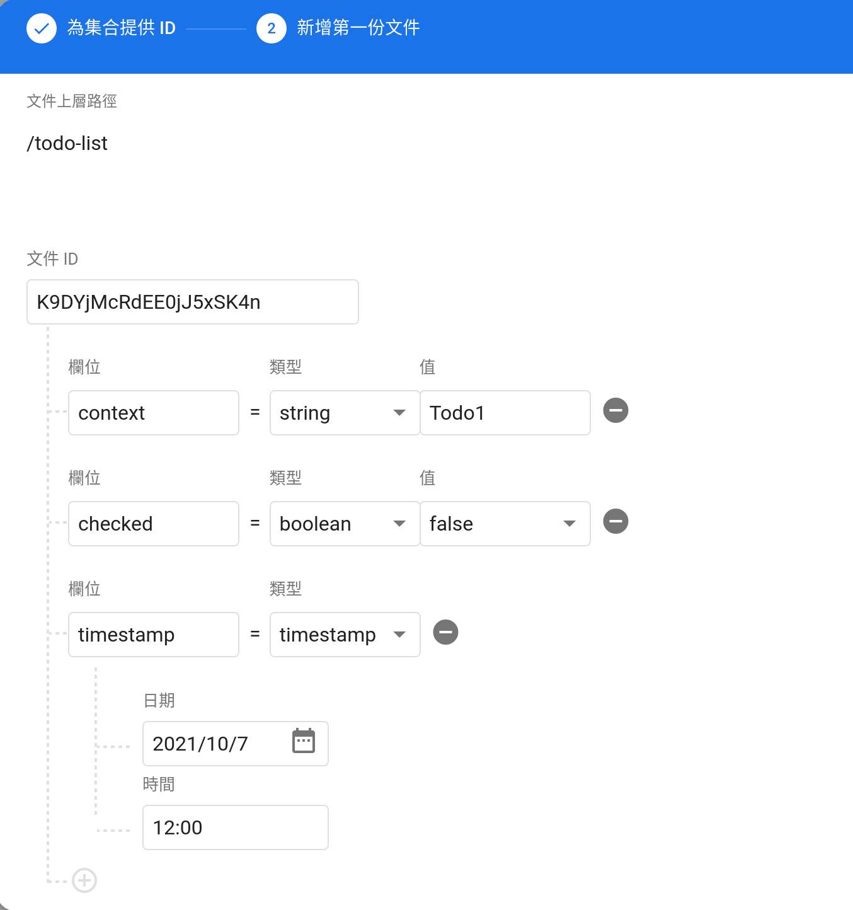

# Firebase Todo Demo

This demo is using only vanilla JavaScript with ES6 syntax and Firebase SDK.

You can checkout the result on the [demo site](https://tododemo-7c2c9.web.app).

## Development

1. Make sure you have Node.js installed and clone this repo.

   ```
   git clone https://github.com/stanley2058/FirebaseTodoDemo.git
   cd FirebaseTodoDemo
   npm i
   ```

2. Create a Firebase application, go to [Firebase](https://console.firebase.google.com/) and follow the instructions.
3. Wait for the project to finalize, click on your target application type, **_Web_** (the XML looking one) for this demo. (You can also find the settings by clicking on the gear icon on top of the left sidebar.)

   

4. Register the application and retain the project credentials. You should get something like this:

   ```javascript
   // Your web app's Firebase configuration.
   const firebaseConfig = {
     // Replace the following with the code you get from Firebase.
     apiKey: "...",
     authDomain: "...",
     projectId: "...",
     storageBucket: "...",
     messagingSenderId: "...",
     appId: "...",
   };
   ```

5. Setup your application using the project credentials and Firebase SDK. For the demo app, copy `config.example.js` to `config.js` and replace the credentials in the template.

> See the official documents for detail information: _[Add Firebase to your JavaScript project](https://firebase.google.com/docs/web/setup)_

6. To save data, we need to enable the Firestore Database.

   

   Choose the **production mode** and select a location for the Firestore, any of them are fine.

7. After the database finishes setting up, create a _collection_ and add at least one entry.

   

8. Now we need to set up access rules for our database, go to **Rules** and set up rules following official documents. Noticed that, Firestore does not allow write access with wildcard in production mode for safety reasons. For the demo app, we have to allow all read and write access on the `todo-list` collection.

   ```
   rules_version = '2';
   service cloud.firestore {
       match /databases/{database}/documents {
           match /todo-list/{todo} {
               allow read, write: if true;
           }
       }
   }
   ```

9. Now start the Vite dev server, you can see our Todo app is working properly.

   ```
   # Start the Vite dev server
   npm run dev
   ```

10. After reviewing the application and making sure it's working, we need to build it first before deployment.

    ```
    # Build and bundle using Vite
    npm run build
    ```

11. To use Firebase Hosting, you'll need to login and set up using Firebase cli tools. Normally Firebase uses `/public` folder as the root for hosting, I change it to `/dist` to match the output of Vite for this demo app. The setting can be viewed in `firebase.json`.

    ```
    # Install and login
    npm install -g firebase-tools
    firebase login

    # Use previously created project, make sure to change the <project id>
    firebase use <project id>

    # Deploy the project
    firebase deploy
    ```

_This demo app is easily developed using [Bootstrap 5](https://getbootstrap.com/docs/5.0/getting-started/introduction/) for styling, [Vite](https://vitejs.dev/) for templating and [Firebase SDK](https://www.npmjs.com/package/firebase) 9 (Tree-shakable API)._
